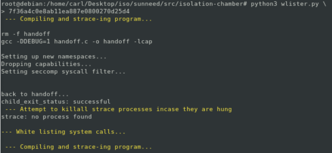
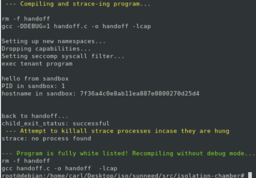

# - Isochamber -

So you want to set up / use isochamber with Sunneed? This is a detailed set of steps to get you on your way!
Note: Use a Debian 10 environment/VM!

## Build and Use:

1. Before building Isochamber, Sunneed must first be made and built. This is because the last two steps of the isochamber build process copies two shared objects, generated during sunneed's make process, into Isochamber's base tenant filesystem. See how to make and build Sunneed in the main Sunneed README.md file (must go through `make` process and then run `build/sunneed`.

   ---------------------

2. Building Isochamber:

   (commands must be run as root, use `sudo`  to enter individual commands as root or use `su -l` to enter root user mode with necessary $PATH variables )

   ```
   root@debian:~/sunneed# cd src/isolation-chamber/
   root@debian:~/sunneed/src/isolation-chamber# python3 build.py
   ...
   ...
   ...
   I: Configuring systemd...
   I: Base system installed successfully
   --- Build Complete ---
   root@debian:~/sunneed/src/isolation-chamber#
   ```

   If all goes well, you will see the `--- Build Complete ---`. Otherwise error messages will be raised. This builds the directory structure to hold the base tenant file system, and directories to hold new tenant packages (`isocchamber/new_tenants`), persistant tenant data (`isochamber/tenants_persist/`) as well a directory that their individual containers will be installed to (`isochamber/tenants_fs`).

   Possible errors:

   * Isochamber has already been built and wasn't fully removed before building again
   * Sunneed hasn't been made yet (call `make` within root sunneed directory). Thus `build.py` is trying to copy shared objects that haven't been generated yet.

   --------------

3. Now that the isochamber strucures have been installed, we can begin to configure tenant containers. So how do we get take an executable from a tenant and run it within a container? We give them a defined template in which to place their programs and dependencies needed. We will give tenants this blank template in the form of a folder...

   ```
   sample_container/
   			|--- config.json
   			|--- progs/
   						 |--- install_deps.sh
   ```

   ...where `config.json` is a blank json waiting to be filled in...

   ```
   {
   	"tid":"",
   	"cname":"",
   	"dependencies":"/home/install_deps.sh",
   	"init":""
   }
   ```

   ... and `progs/` is directory containing only install_deps.sh:

   ```
   #!/bin/sh
   LIST_OF_DEPENDENCIES=""
   
   apt-get update
   apt-get install -y libprotobuf-c1 $LIST_OF_DEPENDENCIES
   ```

   The tenant is responsible for filling out `cname`, as well as the `init` field. The `dependencies` & `init` fields are the paths of executables to be execed by the `handoff.c` program. The`dependencies` field by default points to `install_dependencies.sh` which will automatically be propogated to the tenant's `home/` directory (as will the entire contents of `progs/`directory). If a tenant wanted to structure `progs/` with `install_deps.sh` in some subdirectory, the `config.json` `dependencies` field should be updated to refelct that.  The tenant will be given a unique tenant id during configuration and this will be placed in the `tid` field once this entry is placed into `/root/isochamber/containers.json`.

   Any dependencies a tenant needs for their program to run should be inserted into `LIST_OF_DEPENDENCIES` in `install_dependencies.sh`. System resources will be monitored and regulated by Sunneed, and for this IPC to function properly, the tenant needs to have protobuf installed. On Debian, this package is `libprotobuf-c1` so this is installed by default on tenants.

   The tenant is responsible for making sure that their executables are compiled correctly for our system. It will cause errors if the objects are compiled for the wrong system, obviously.

   Note: if you are testing something that doesn't require sunneed -> tenant communication, protobuf won't be necessary and this can be removed from the dependencies to save time during testing. 

   ---------------

4. Let's configure a tenant container. Once Isochamber is built and you have a tenant package ready to go, you need to drop that package where new tenants go (`/root/isochamber/new_tenants/`). I will show you what this looks like with an example container located in `isochamber/test_containers/`:

   ```
   root@debian:~/sunneed/src/isolation-chamber# cp -rp test_containers/hello_container \
   > /root/isochamber/new_tenants/
   ```

   (`-r` sets the recursive copy flag to copy everything within directory subtree & `-p` allows all copies to retain the correct permissions )

5. Now it's time to take this tenant package and install the specified container. For this we use `tenant_config.py` and specify the name of the tenant package:

   ```
   root@debian:~/sunneed/src/isolation-chamber# python3 tenant_config.py hello_container
   ...
   ...
   --- Tenant Configured! ---
   tid: 7f36a4c0e8ab11ea887e0800270d25d4
   root@debian:~/sunneed/src/isolation-chamber#
   ```

   If all goes well you should see this success message above.

   Possible error: If you get error messages complaining that the program couldn't bind or mount `/tmp/tenant_ipc` then sunneed hasn't been run yet (`build/sunneed`). This must be run at least once for `/tmp/tenant_ipc/sunneed.ipc` to be created. This is the file that allows IPC between host and tenant. If any IPC needs to happen, this step is essential or the tenant won't have access to that file. 

   Note: This example container requires no extra dependencies so downloads nothing. Any container with dependencies specified will install them during this step. Further, `tenant_config.py` runs `handoff.c` in configuration mode which allows the container internet access to be able to download dependencies. Otherwise all network communication will need to happen through Sunneed.

6. Copy and paste the tid returned above. It's time to generate a whitelist of allowed system calls for this container. 

   ```
   root@debian:~/sunneed/src/isolation-chamber# python3 wlister.py \
   > 7f36a4c0e8ab11ea887e0800270d25d4
   ```

   `wlister.py` compiles `handoff.c` in debug mode and reads the strace output to find system calls to 	whitelist. This whitelist is saved in `/root/isochamber/tenants_persist/<tid>/filter.gen.h`. Whitelisting happens in a loop until no system calls cause the program to trap. This will produce output similar to below if everything works:

   

   

   Note: potentially malicious system calls being whitelisted will produce red warnings during whitelisting.

7.  Now that the container has it's whitelist generated, we are ready to start up the container and handoff execution to the tenant. For this we use `handoff.py`:

   ``` 
   root@debian:~/sunneed/src/isolation-chamber# python3 handoff.py \
   > 7f36a4c0e8ab11ea887e0800270d25d4
   rm -f handoff
   gcc handoff.c -o handoff -lcap
   Setting up new namespaces...
   Dropping capabilities...
   Setting seccomp syscall filter...
   exec tenant program
   
   hello from sandbox
   PID in sandbox: 1
   hostname in sandbox: 7f36a4c0e8ab11ea887e0800270d25d4
   
   
   back to handoff...
   child_exit_status: successful
   root@debian:~/sunneed/src/isolation-chamber#
   ```

   The output above is what you should see if you are following along. 

   You have now built isochamber, onboarded a new tenant, whitelisted their system calls, and run said tenant's programs within an isolated container!

8. *(Optional)* - This step is not necessary and just for ease of development. Right now, by default, the containers spawned by `handoff.py` do not have any network connection as they are placed in a unique network namespace and will rely on Sunneed to handle network connections in the future (this has not been developed yet). `handoff.py` is really just a wrapper program for `handoff.c` which allows useful python scripting before and after program execution. Therefore, to ease development and testing of containers, there is an optional `-configure` flag that can be used with `handoff.py`. This flag will compile `handoff.c` in configure mode which doesn't drop root capabilities, and doesn't install a seccomp whitelist filter. It also allows the child process to remain in the same net namespace as the host. `handoff.py` will then run a network enabled bash session. This could be useful for downloading dependencies without completely reconfiguring a tenant, cloning git repos, general debugging, and more. You can run any configured tenant in configure mode. Therefore, I will demonstrate with our `hello_container` example:

   ```
   root@debian:~/sunneed/src/isolation-chamber# python3 handoff.py \
   > 7f36a4c0e8ab11ea887e0800270d25d4 -configure
   rm -f handoff
   gcc -DCONFIG=1 handoff.c -o handoff -lcap
   Setting up new namespaces...
   root@7f36a4c0e8ab11ea887e0800270d25d4:/# ls
   bin boot dev etc home lib lib32 lib64 libx32 media mnt opt proc root run sbin srv sys tmp usr var
   root@7f36a4c0e8ab11ea887e0800270d25d4:/# exit
   exit
   
   back to handoff...
   child_exit_status: successful
   root@debian:~/sunneed/src/isolation-chamber#
   ```

   

9. *(Optional)* - Deleting containers. Container data is held in multiple places under `/root/isochamber/` including: `tenants_fs/`, `tenants_persist/`, `containers.json`. The directory data and json entry must be deleted to fully remove a container. To ease this process, `delete_tenant.py` does all of this for you and all you have to do is pass along the tenant id (tid).

   ```
   root@debian:~/sunneed/src/isolation-chamber# python3 delete_tenant.py \
   > 7f36a4c0e8ab11ea887e0800270d25d4
   ```

---------------------------------

## Makefile / Compilation:

```
CC=gcc
CFLAGS=-lcap

handoff: handoff.c
	$(CC) handoff.c -o handoff  $(CFLAGS)

debug: handoff.c
	$(CC) -DDEBUG=1 handoff.c -o handoff $(CFLAGS)

config: handoff.c
	$(CC) -DCONFIG=1 handoff.c -o handoff $(CFLAGS)

clean:
	rm -f handoff
```

* Compile with gcc
* Compile with `-lcap` flag. `handoff.h` includes `<sys/capability>` which requires downloading the package `libcap-dev` and compiling with `-lcap` flag. This library is used to drop root capabilities from the tenant process.
* `make` simply runs `make handoff` which compiles the program in production ready mode.
* `make debug` compiles the program so that the seccomp filter causes the tenant process to trap instead of be killed. This allows the system call trapping the program to be found with strace. `wlister.py` makes use of `make debug` so that it can whitelist tenant system calls.
* `make config` compiles the program so that the cloned child (tenant) process is slightly less isolated than during normal runtime operation. When compiling in configuration mode, the tenant process is left in the same network namespace as the host. This allows dependency installation because in production, Sunneed will handle network connections transparently for the tenant and this functionality has not been developed yet. Further, this compilation mode doesn't drop root capabilities or install a seccomp system call filter. This allows a great debugging/testing envinment for the developer as it lets them spawn any installed container with a bash shell and full access. 

---------------------

## Testing:

Within `isochamber/`, there is a directory full of test programs (`test_progs`) and a directory full of test containers (`test_containers`). The test containers contain programs from `test_progs`. These may need to be recompiled if running on a different system. This can be done easily with:

```
root@debian:~/sunneed/src/isolation-chamber# gcc -o \
./test_containers/simple_test/progs/test_simple ./test_progs/test_simple.c
```

This test container can then be configured as a tenant container starting with step 4 above.

There are two files meant to help with automated testing called `pipeline.py` and `testscript.py`. The `pipeline.py` script first executes `build.py`, followed by `testscript.py`. This is meant to let you easily test by only having to execute one file. Once Sunneed is cloned, made, and built, all you have to do within `isolation-chamber` is run `python3 pipeline.py`. 

`testscript.py` makes use of 4 test containers: 

* `simple_test` just tests that a container can be spawned and prints hello. Within `testscript.py`, this test is just used to test the creation of a seccomp filter. The `wlister.py` program generates a unique filter for `test_simple.c` and compares it to `simplefilter.txt` which holds the correct filter for this test.
* `seccomp_test` is used to test code that hasn't been whitelisted. `testscript.py` runs `test_seccomp.c` without whitelisting it. This test is used to confirm that programs runningunlisted system calls will be killed.
* `cap_test` makes some system calls that require some root capabilties that have been dropped for the tenant. This tests that those calls fail and return errors. 
* `ipc_test` tests end-to-end communication between the tenant and the host, Sunneed. This first tests `tenant_config.py`'s ability to download and install dependencies. The `libprotobuf-c1` library will be donwloaded during configuration and the test will fail if it isn't installed properly. Once it is configured and container is spawned, the tenant program (run-with-overlay & overlay_tester) will attempt to connect to Sunneed to grab a file descriptor (Sunneed must be running for this to work).

At the end of `testscript.py`, the containers spawned during testing are deleted as to avoid unnecessary overhead that would accumulate after multiple runs of the program.

NOTE: Understanding how `testscript.py` interacts with the different programs and reading the [Isochamber documentation](./isochamber_documentation/isochamber_documentation.md) will help clear up any confusion on the use of Sunneed's Isochamber. The [system overview](./isochamber_documentation/isochamber_system_overview.md) will help to understand how the different parts of the Isochamber system structure interact with eachother.

-------------------


